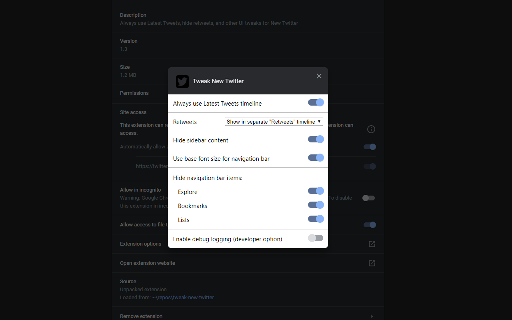

# Tweak New Twitter

**Hide retweets, and other UI tweaks for New Twitter**

* [Install Chrome Extension](https://chrome.google.com/webstore/detail/kpmjjdhbcfebfjgdnpjagcndoelnidfj)
* [Install Firefox Add-on](https://addons.mozilla.org/en-US/firefox/addon/tweak-new-twitter/)
* [Install as a user script](https://greasyfork.org/en/scripts/387773-tweak-new-twitter) (requires a [user script manager](https://greasyfork.org/en#home-step-1))

## Features

- Hide retweets in your Latest Tweets / Home timeline
- Hide sidebar content (Trends, Who to follow, sidefooter)
- Hide some less-used nav links (Explore, Bookmarks, Links)
- Apply the base font size to the primary nav to make it less distracting

## Screenshots

Timeline view with all tweaks enabled (default):

Chrome extension options dialog:

Firefox extension page options:

## Attribution

Icon adapted from "Twitter free icon" by [Icomoon](https://icomoon.io/) from [www.flaticon.com](https://www.flaticon.com/), [CC 3.0 BY](https://creativecommons.org/licenses/by/3.0/)
