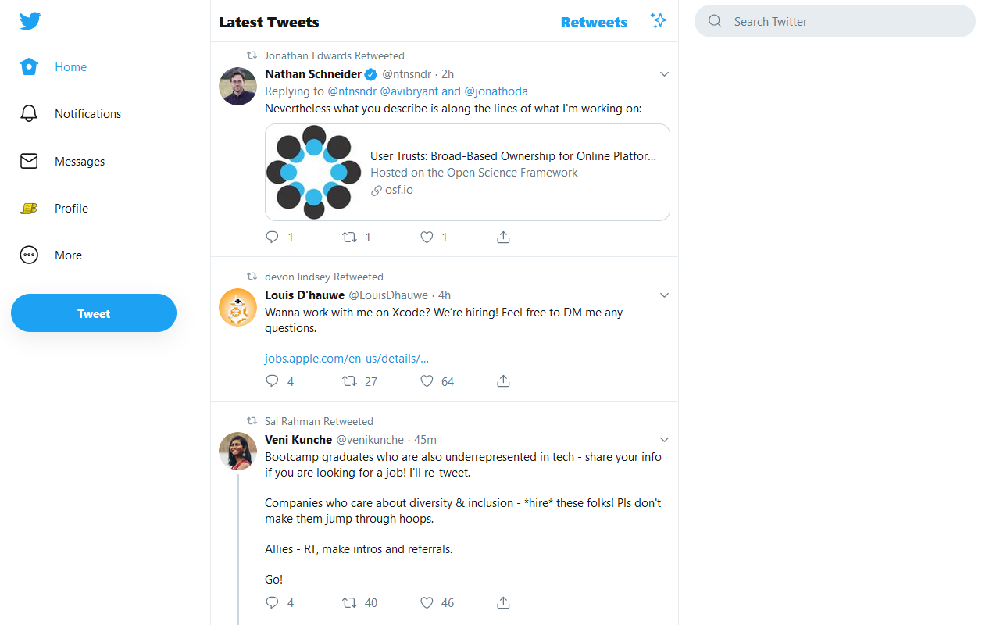

# Tweak New Twitter

**Reduce "engagement" and tone down some of New Twitter's UI**

* [Install Chrome Extension](https://chrome.google.com/webstore/detail/kpmjjdhbcfebfjgdnpjagcndoelnidfj)
* [Install Firefox Add-on](https://addons.mozilla.org/en-US/firefox/addon/tweak-new-twitter/)
* [Install as a user script](https://greasyfork.org/en/scripts/387773-tweak-new-twitter) (requires a [user script manager](https://greasyfork.org/en#home-step-1))

## Features

- Always use the Latest Tweets (chronological) timeline - automatically switches you back when Twitter decides they'd rather you were on the "Home" (algorithmic) timeline because "engagement"
- Move retweets to a separate Retweets timeline, or hide them entirely
- Remove sidebar content (Trends, Who to follow, sidefooter)
- Remove some less-used links from the primary nav (Explore, Bookmarks, Links)
- Use the site's base font size and normal font weight in the primary nav to make it less distracting (using your selected font size from the Display / Customize your view dialog)

## Screenshots

Timeline view with all tweaks enabled (default):

The new Retweets timeline, containing retweets only:

Chrome extension options dialog:

Firefox extension page options:

## Attribution

Icon adapted from "Twitter free icon" by [Icomoon](https://icomoon.io/) from [www.flaticon.com](https://www.flaticon.com/), [CC 3.0 BY](https://creativecommons.org/licenses/by/3.0/)
