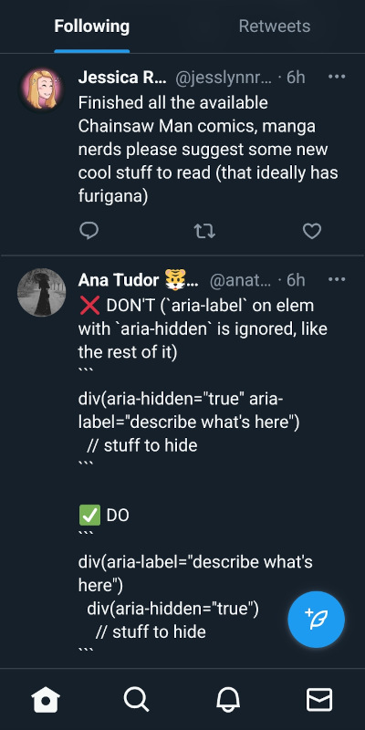
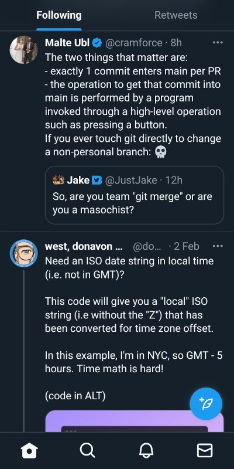
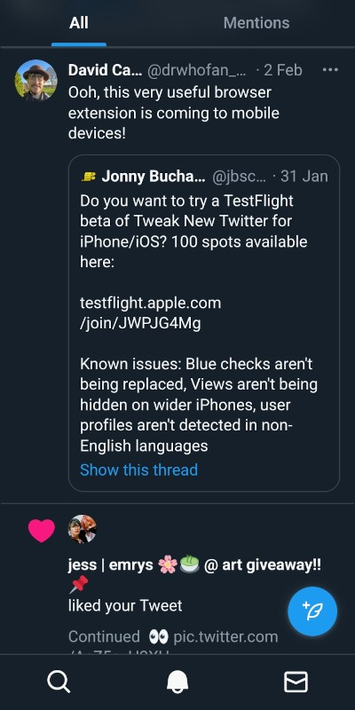
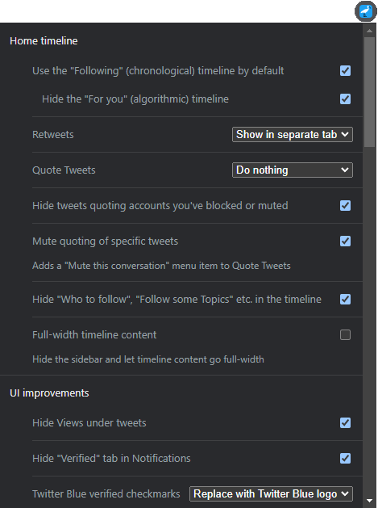

# Control Panel for Twitter

**Control Panel for Twitter is a browser extension which gives you more control over Twitter and adds missing features and UI improvements**

## Install

* [Safari Extension](https://apps.apple.com/app/id1668516167?platform=iphone) - for iPhone, iPad and Mac

  
* [Firefox Extension](https://addons.mozilla.org/en-US/firefox/addon/control-panel-for-twitter/) - can also be installed in [Firefox Beta](#install-in-firefox-beta-on-android) on Android
* [Chrome Extension](https://chrome.google.com/webstore/detail/control-panel-for-twitter/kpmjjdhbcfebfjgdnpjagcndoelnidfj) - can also be installed in Edge, Opera, and Brave on desktop, and [Kiwi Browser](https://play.google.com/store/apps/details?id=com.kiwibrowser.browser) on Android
* [Edge Add-on](https://microsoftedge.microsoft.com/addons/detail/control-panel-for-twitter/foccddlibbeccjiobcnakipdpkjiijjp)
* [User script version](https://greasyfork.org/en/scripts/387773-control-panel-for-twitter) - requires a [user script manager](https://greasyfork.org/en#home-step-1)

### Install in Firefox Beta on Android

Mozilla Add-ons currently only lets you install a [small, curated list of extensions on Android](https://addons.mozilla.org/en-US/android/), so you'll need to add a Custom Add-on collection which contains Control Panel for Twitter by following these steps:

- Install [Firefox Beta](https://play.google.com/store/apps/details?id=org.mozilla.firefox_beta) on your Android device
- [Follow these instructions](https://blog.mozilla.org/addons/2020/09/29/expanded-extension-support-in-firefox-for-android-nightly/) to enable Custom Add-on collections, TL;DR:
  - Settings → About Firefox Beta → Tap on the Firefox logo 5 times
- In "Custom Add-on collection", which is now available under Advanced settings, enter the following details and tap "OK":
  - 13844640
  - Android-Collection

  

  You'll now be able to install Control Panel for Twitter via the Add-ons page.
  

  

## Releases / What's New?

The [Control Panel for Twitter Releases page](https://github.com/insin/control-panel-for-twitter/releases) highlights new features, changes and fixes in each version, and shows which version is currently published on each of the browser extension stores.

New versions can take anything from minutes to days to be approved for publishing after they're submitted to a browser extension store.

## Features

### Home timeline

- Defaults to the "Following" (chronological) timeline, automatically switching you back if Twitter tries to move you to the "For you" (algorithmic) timeline
- Hide the "For you" timeline tab (default setting)
- Move Retweets to a separate tab (default setting), or hide them entirely
- Move Quote Tweets and replies to them to a separate tab in the Home timeline, or hide them entirely
- Hide tweets quoting accounts you've blocked or muted
- Mute quoting of specific tweets - adds a "Mute this conversation" menu item to Quote Tweets in the Home and List timelines
- Hide "Who to follow", "Follow some Topics" etc. in the Home timeline and elsewhere
- Full-width timeline: hide the sidebar and let timeline content go full-width on Home, Lists and Communities

### UI improvements

- Hide Views under tweets
- Hide the "Verified" tab on the Notifications page
- Replace Twitter Blue checkmarks with the Blue logo so they're not as easily mistaken for verified accounts, or hide them altogether
- Add "Add muted word" to the "More" menu (desktop) or slide-out menu (mobile)
- Fast blocking - skips the confirm dialog when you try to block an account
- Toggle Retweets in Lists - adds a "Turn off Retweets" menu item to Lists
- Use the site's normal text font style in the primary navigation menu on desktop to make it less distracting
- Use normal font weight in dropdown menus - if everything's bold, nothing's bold
- Hide "Open app" nags on mobile

### UI tweaks

- Disable use of the Chirp font if you don't like it
- Uninvert the Follow and Following buttons to make them less jarring
  - Choice of monochrome or themed (classic) styling for uninverted buttons
- Default to "Latest" tab in Search
- When viewing a tweet's Quote Tweets, hide the quoted tweet to make more room for quotes

### Remove algorithmic content

- Hide "What's happening", "Topics to follow" etc. in the sidebar
- Hide Explore page contents and use it only for searching
- Hide "Discover more" algorithmic tweets when viewing a tweet

### Reduce "engagement"

- Hide metrics
- Reduced interaction mode: hide the action bar under tweets – replies are now the only means of interacting
- Disable the home timeline: find yourself [wasting too much time on Twitter](https://world.hey.com/brecht/free-range-tweet-farming-9399f6e5)? Try preventing use of the home timeline, going to Notifications or Messages by default instead

### Hide UI items you don't use

- Share button under tweets
- Analytics links under your own tweets
- Hide navigation items you don't use on desktop, and other distracting screen elements such as the account switcher and Messages drawer
- Hide the bottom nav items for Communities and Messages on mobile if you don't use them
- Hide items you don't use in the "More" menu (desktop) or slide-out menu (mobile)

## Screenshots

### Home timeline with most tweaks enabled

| Desktop | Mobile |
| - | - |
|  |  |

### Separate timeline for Retweets (default setting) and/or Quote Tweets

| Desktop | Mobile |
| - | - |
|  |  |

### Full-width timeline

| Desktop only |
| - |
|  |

### Tidied-up menu, with instant access to "Add muted word"

| Desktop - "More" menu | Mobile - slide-out menu |
| - | - |
|  |  |

### Hide metrics

| Desktop | Mobile |
| - | - |
|  |  |

### Uninverted Follow buttons

| Monochrome | Themed |
| - | - |
|  |  |

### Disable use of Chirp font

| Chirp on | Chirp off |
| - | - |
|  |  |

### Improved Quote Tweets page

The quoted tweet is hidden, instead of being duplicated under every quote, leaving more room for quotes

| Desktop | Mobile |
| - | - |
|  |  |

### Reduced interaction mode

| Desktop | Mobile |
| - | - |
|  |  |

## Disable the home timeline

| Desktop | Mobile |
| - | - |
|  |  |

### Configurable via options popup and the extension options page

| Desktop | Mobile |
| - | - |
|  |  |

### Other mobile features

| No trends on Explore screen, just search | No "Open app" nag in tweet header |
| - | - |
|  |  |

### Language support

As of v2.2, all 48 of the display languages available on Twitter are supported, some examples:

| Gaeilge (Irish) | 日本語 (Japanese) | العربية (Arabic) |
| - | - | - |
|  |  |  |

Options are also available in the following languages:

- French (translation by [@THEDARKK](https://github.com/THEDARKK))
- Japanese (translation by [@MitoKurato](https://github.com/MitoKurato))
- Spanish (translation by [@rogama25](https://github.com/rogama25))

### User script support

 [Control Panel for Twitter is also available as a user script](https://greasyfork.org/en/scripts/387773-control-panel-for-twitter) – to change the default options, you'll need to edit the `config` object at the top of the script.

## Attribution

Icon adapted from "Ibis icon" by [Delapouite](https://delapouite.com/) from [game-icons.net](https://game-icons.net), [CC 3.0 BY](https://creativecommons.org/licenses/by/3.0/)
